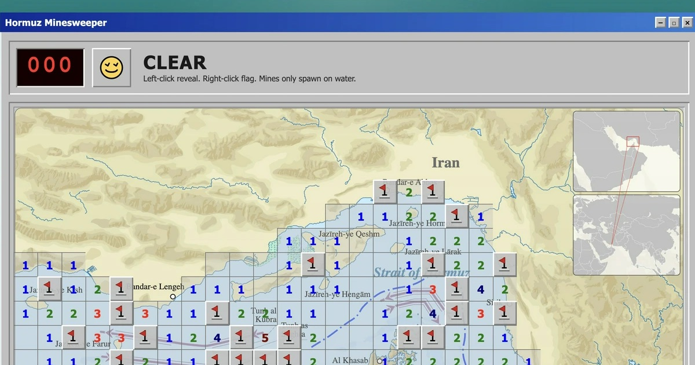

# Hormuz Minesweeper

Classic Minesweeper laid across the Strait of Hormuz. Clear the water, flag the mines, and survive the shipping lane.

**[Play now](https://hormuz.pythonic.ninja/)**

## How to play

| Action | Mouse | Touch (iPad) |
|---|---|---|
| Reveal a cell | Left-click | Tap (dig mode) |
| Flag / unflag a mine | Right-click | Tap (flag mode) |
| Switch dig/flag mode | — | Long-press |
| Chord (auto-reveal neighbors) | Double-click a number | Double-tap a number |

Mines only spawn on water. Your first click is always safe.

**Chording:** When a revealed number has exactly that many adjacent flags, double-click it to reveal all remaining neighbors at once. Careful — if a flag is misplaced, you hit a mine.

## Tech

Zero dependencies. Three files:

- `index.html` — markup + Win95-style CSS
- `index.js` — game logic, rendering, event handling
- `map.svg` — nautical chart of the Strait of Hormuz

Just open `index.html` in a browser. No build step required.

## License

MIT
